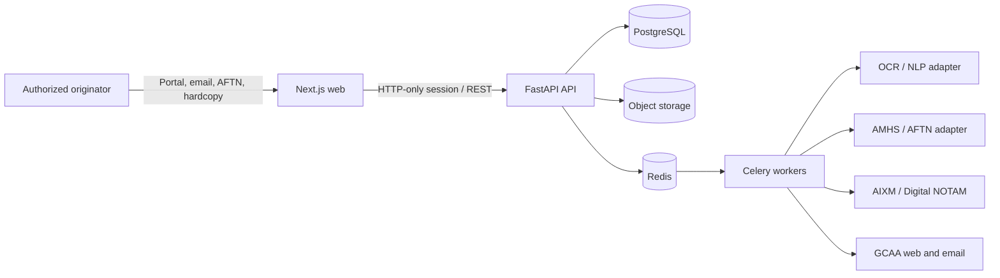

# NOTAMSYS architecture

## System context

NOTAMSYS is a safety-oriented workflow system for the Accra International NOTAM Office. It captures source information, prepares an ICAO text NOTAM and AIXM Event, enforces independent review, publishes through controlled adapters, and retains quality evidence.

## Bounded modules

- Intake: source identity, acknowledgement, evidence hash and extraction results.
- Rules: controlled ICAO selection tables, local procedure checks and rule provenance.
- Preparation: NOTAMN/R/C relationships, Series A/B, Q-line, Items A-G and formatting.
- Review: specialist comparison, four-eyes control, remote approval evidence and comments.
- Publication: asynchronous channel deliveries with independent acknowledgements.
- Tracking: EST/PERM obligations, cancellation/replacement links and monthly checklists.
- QMS: immutable audit events, findings, corrective actions and quality indicators.

## Design decisions

1. PostgreSQL is the system of record. UI state never authorizes a workflow transition.
2. Every transition is checked against an explicit state machine in `services/workflow.py`.
3. The source attachment is content-addressed by SHA-256 and treated as immutable.
4. AI/OCR produces suggestions and confidence values only. An officer confirms operational fields.
5. The selection-criteria ruleset is versioned and its exact version is stored with every draft.
6. Publication is channel-specific. A NOTAM is not considered delivered merely because it was queued.
7. A preparer cannot approve the same NOTAM.

## Production extensions

See [docs/OPERATIONAL_BOUNDARY.md](OPERATIONAL_BOUNDARY.md) for the full, maintained capability table. Summary of what's still outstanding:

- Switch the storage backend to MinIO/S3 in a real deployment (`MinioStorage` exists behind the same interface as the local default; not yet exercised against a live server).
- Get independent sign-off on the visually-verified 1250-rule Doc 8126 selection table before treating it as the licensed, approved ruleset (see `services/rules.py`'s dataset docstring for how verification status is tracked per row).
- Connect a live AMHS/AFTN circuit (the adapter interface, envelope construction and a file-drop integration exist; there is no live circuit, credentials, or spec to connect to yet), plus real GCAA website/email publication backends.
- Get the real GCAA AIP into the reference-data seam (`services/aip/`) once it's accessible — it's currently SharePoint-restricted; the seed dataset deliberately leaves out anything not already known rather than inventing it.
- Install the `tesseract` binary and validate the OCR pipeline against real scanned/photographed documents (currently verified via the PDF-text-layer path and `NullOcr` fixtures, which don't require it).
- Deploy PostgreSQL in high availability mode with point-in-time recovery and an immutable audit export.
